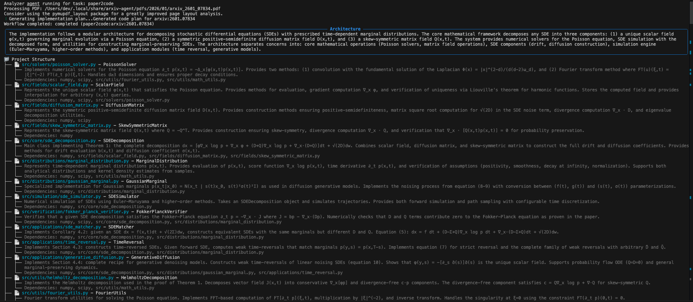

# ArXiv Agent

> **Your AI-Powered Research Assistant.**  
> Automatically discover, analyze, and implement research from arXiv papers using the power of advanced LLMs.

[](https://www.python.org/downloads/)
[](https://opensource.org/licenses/MIT)
[](https://github.com/psf/black)

---

**ArXiv Agent** is a terminal-based intelligent assistant designed for researchers and engineers who want to stay on top of the latest AI trends without drowning in PDFs. It combines **daily digests**, **RAG-powered chat**, and **automated implementation** into a single, cohesive workflow.



## 🚀 Key Features

*   **📰 Smart Daily Digests**: Wake up to a personalized summary of the latest papers in your field (e.g., "Agentic AI", "Vision Transformers"), delivered directly to your terminal or markdown reader.
*   **💬 Chat with Papers**: Use RAG (Retrieval Augmented Generation) to ask questions across your entire library or deep-dive into a specific paper. "How does the ablation study in Table 3 support their claim?"
*   **🛠️ Paper-to-Code**: Automatically generate a Python implementation plan and scaffolding based on the methodology section of a paper.
*   **🧠 Multi-Model Support**: Bring your own keys! Supports **Anthropic**, **OpenAI**, and **Google Gemini** with dynamic model selection.
*   **🔒 Layout & Privacy First**: Data is stored locally (`~/.local/share/arxiv-agent`). API keys are secured in your system keyring.


## 📦 Installation

Prerequisites: Python 3.10+ and `pip`/`uv`.

```bash
# Clone the repository
git clone https://github.com/DevJadhav/arxiv-agent.git
cd arxiv-agent

# Install via pip (from local source)
pip install .

# OR strictly via uv (Recommended)
# Run this from the project root to install the local version
uv tool install . --force
```


## ⚡ Quick Start

### 1. Setup Your LLM Provider
ArXiv Agent needs an LLM to function. Configure your preferred provider securely:

```bash
# Setup Anthropic (Recommended)
arxiv-agent config provider setup anthropic

# OR OpenAI / Gemini
arxiv-agent config provider setup openai
arxiv-agent config provider setup gemini
```

### 2. Search & Download
Find interesting papers and add them to your local library.

```bash
# Search for papers
arxiv-agent search "agentic workflow" --limit 5

# Download a specific paper by ID
arxiv-agent download 2310.12345
```

### 3. Analyze & Chat
Deep dive into your library.

```bash
# Generate a summary analysis
arxiv-agent analyze 2310.12345

# Chat with a paper
arxiv-agent chat 2310.12345
> "Explain the core contribution of this paper?"
```

## 🛠️ Configuration

## 🛠️ Configuration
 
You can customize which models are used for different tasks (e.g., use Claude Opus for coding but Gemini Flash for chat).
 
```bash
# List current config
arxiv-agent config models show
 
# Set model interactively (Prompted for Agent -> Provider -> Model)
arxiv-agent config models set
 
# Or define specific agent/provider to list models for
arxiv-agent config models set code --provider openai
```

The CLI will automatically fetch available models from your API key and present a scrollable list for selection.

## 📚 Documentation

*   [**Architecture & Design**](docs/ARCHITECTURE.md): Deep dive into the system internals, database schema, and agent workflows.
*   [**Contribution Guide**](docs/CONTRIBUTING.md): How to set up a dev environment and contribute.

## 🤝 Contributing

We welcome contributions! Please check out our [Architecture Guide](docs/ARCHITECTURE.md) to understand the system before diving in.

## 📄 License

This project is licensed under the MIT License - see the [LICENSE](LICENSE) file for details.
