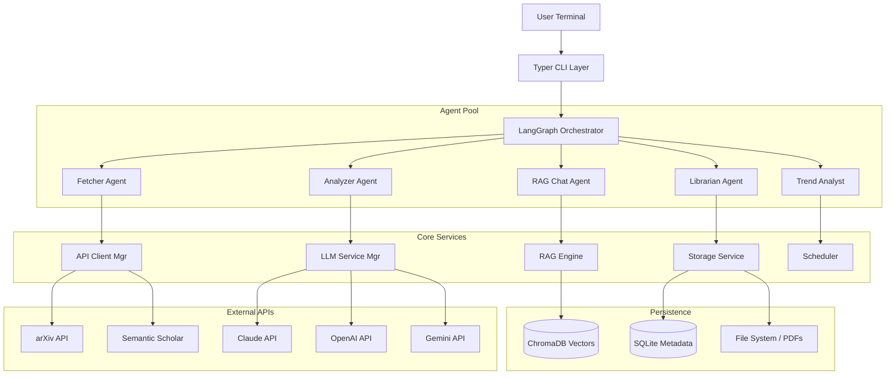

# ArXiv Agent Architecture

## 1. High-Level System Architecture

ArXiv Agent is designed as a modular, offline-first CLI system with intelligent cloud fallbacks.

## 2. Core Components

### User Interface Layer
- **Typer CLI**: Handles command parsing and routing.
- **Rich Console**: Provides beautiful terminal output (tables, markdown, progress bars).

### Orchestration Layer (LangGraph)
Manages state and workflows between agents. Uses a graph-based Execution model:
- **State**: Shared context (`papers`, `analysis`, `chat_history`).
- **Nodes**: Individual agents or processing steps.
- **Edges**: Routing logic based on agent outputs.

### Data Persistence
- **SQLite**: Stores structured metadata (papers, chat history, user prefs).
- **ChromaDB**: Vector store for document embeddings (dense retrieval).
- **File System**: Raw PDF storage and generated artifacts (digests, code).

## 3. Data Flow Workflows

### 3.1 Daily Digest Flow
1. **Trigger**: APScheduler runs job at configured time.
2. **Fetch**: Query arXiv API for new papers matching user keywords.
3. **Download**: Fetch PDFs for relevant papers.
4. **Analyze** (Overnight): 
   - Parse PDFs to text.
   - Generate summaries and relevance scores using LLM.
   - Extract methodology and key findings.
5. **Output**: Generate Markdown digest and save to `~/.local/share/arxiv-agent/digests/`.

### 3.2 RAG Chat Flow
1. **Retrieval**: Hybrid search (Dense + Sparse/BM25) on paper chunks.
2. **Reranking**: Cross-encoder reranking for high precision.
3. **Context**: Assemble retrieved chunks + chat history.
4. **Generation**: Stream response from LLM (Claude/OpenAI/Gemini).

### 3.3 Paper-to-Code Flow
1. **Planning**: LLM analyzes paper to design implementation plan.
2. **Spec Generation**: Detailed specs for each component.
3. **Code Gen**: Iteratively generate code, tests, and docs.
4. **Validation**: Syntax check and type checking.

## 4. Database Schema

### SQLite Schema
- **papers**: `id`, `title`, `abstract`, `pdf_path`
- **analyses**: `paper_id`, `content` (JSON), `model_used`
- **chat_sessions**: `id`, `paper_id`, `history`
- **collections**: `id`, `name`, `papers` (M:N)

### ChromaDB Collections
- **paper_chunks**: Text chunks with SPECTER2 embeddings.
- **paper_summaries**: Full abstract embeddings for semantic search.

## 5. Security & Privacy
- **API Keys**: Stored in system keyring (Keychain/Credential Manager).
- **Local First**: All data stored locally in `~/.local/share/arxiv-agent`.
- **Encryption**: Optional encryption for sensitive config.
